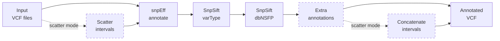

# sm-vcf-annotation

Snakemake 8+ pipeline for annotating VCF files using snpEff, SnpSift, and dbNSFP on SLURM HPC clusters.



Supports both **BIH HPC** and **Charite HPC** (auto-detected), plus local execution.

Part of the [scholl-lab](https://github.com/scholl-lab) bioinformatics suite — designed to run after [sm-calling](https://github.com/scholl-lab/sm-calling).

---

## Setup

### 1. Clone into your project directory

The pipeline should live inside each project's directory on the cluster, not in your home directory (quota is too small for results).

```bash
# Charite HPC
cd /sc-projects/<your-project>
git clone https://github.com/scholl-lab/sm-vcf-annotation.git
cd sm-vcf-annotation

# BIH HPC
cd /data/cephfs-1/work/projects/<your-project>
git clone https://github.com/scholl-lab/sm-vcf-annotation.git
cd sm-vcf-annotation
```

### 2. Install Snakemake 8+ and the SLURM executor plugin

```bash
conda create -n snakemake -c conda-forge -c bioconda 'snakemake>=8.0'
conda activate snakemake
pip install snakemake-executor-plugin-slurm
```

### 3. Set up reference data

The pipeline requires:

| Data | Source | Maps to `config.yaml` |
|------|--------|-----------------------|
| **snpEff database** (e.g., GRCh37.p13) | bundled with snpEff | `snpeff.database` |
| **dbNSFP database** | [dbNSFP downloads](https://sites.google.com/site/jpaborern/dbNSFP) | `snpsift.dbnsfp_db` |
| **Reference genome** (for scatter mode) | NCBI/UCSC | `ref.genome`, `ref.dict` |

### Recommended project layout

```
<your-project>/
├── sm-alignment/                    # alignment pipeline (upstream)
├── sm-calling/                      # variant calling pipeline
├── sm-vcf-annotation/               # this pipeline (git clone)
│   ├── workflow/
│   ├── config/
│   │   ├── config.yaml              # ← edit or generate for your project
│   │   └── samples.tsv              # ← generate from VCF filenames
│   ├── profiles/
│   └── scripts/
├── resources/                       # reference data (or symlinks to shared)
│   ├── ref/GRCh38/
│   └── dbnsfp/
└── results/
    └── variant_calls/               # VCFs from sm-calling (input)
```

---

## Generate Config Files

The config generator scans your VCF directory, discovers samples, and writes `config/samples.tsv` and `config/config.yaml`.

### Interactive wizard (recommended for first-time setup)

Run without arguments for a guided workflow:

```bash
python scripts/generate_config.py
```

```
============================================================
  sm-vcf-annotation — Config Generator
============================================================

Path to VCF folder [results/final]: /data/variant_calls

Found 3 VCF file(s):
  sample1.vcf.gz  (1.2 GB)
  sample2.vcf.gz  (890.5 MB)
  sample3.vcf.gz  (2.1 GB)

Generated 3 sample(s).

Write config files? [Y/n]:
  Wrote: config/samples.tsv
  Wrote: config/config.yaml

Done! Edit config/config.yaml to set database paths before running.
```

### From sm-calling output (flags mode)

When you have VCF files from [sm-calling](https://github.com/scholl-lab/sm-calling):

```bash
# Generate samples.tsv from VCF directory
python scripts/generate_config.py \
    --vcf-folder results/variant_calls/

# Preview without writing (dry-run)
python scripts/generate_config.py --vcf-folder /path/to/vcfs --dry-run

# Overwrite existing files
python scripts/generate_config.py --vcf-folder /path/to/vcfs --overwrite
```

### Options

| Flag | Default | Description |
|------|---------|-------------|
| `--vcf-folder PATH` | *(interactive)* | VCF directory (triggers non-interactive mode) |
| `--dry-run` | off | Preview without writing |
| `--overwrite` | off | Overwrite existing config files |

---

## Configuration Reference

### `config/config.yaml`

Review and adjust after generating:

```yaml
ref:
  genome: "/path/to/reference.fa"      # required for scatter mode
  dict: "/path/to/reference.dict"

paths:
  samples: "config/samples.tsv"        # path to sample sheet
  vcf_folder: "results/final"          # input VCFs
  output_folder: "results/annotation"

snpeff:
  database: "GRCh37.p13"
  extra_flags: "-lof -noInteraction -noMotif -noNextProt -spliceRegionIntronMax 12"

snpsift:
  dbnsfp_db: "dbnsfp/dbNSFP4.9a_grch37.gz"
  dbnsfp_fields: "aaref,aaalt,aapos,SIFT_pred,..."  # full list in config/config.yaml

scatter:
  mode: "none"                         # "none" or "interval"
  count: 100                           # intervals (for interval mode)
  canonical_contigs: []                # contigs to include when scattering

extra_annotations: []                  # optional step-wise SnpSift annotate
```

| Section | Key settings |
|---------|-------------|
| `ref` | Reference genome path and dictionary (required for scatter mode) |
| `paths` | Input VCF folder, output folder, samples TSV path |
| `snpeff` | snpEff database name and extra flags |
| `snpsift` | dbNSFP database path and annotation fields |
| `scatter` | Parallelization mode (`"none"` or `"interval"`) and interval count |
| `extra_annotations` | Optional list of extra VCF annotation steps |

See [`config/README.md`](config/README.md) for full field reference.

### `config/samples.tsv`

One row per VCF file. Generated by `scripts/generate_config.py` or written manually:

```
sample          vcf_basename
SampleA         SampleA
SampleB         SampleB
```

| Column | Description |
|--------|-------------|
| `sample` | Unique sample identifier (used in output filenames) |
| `vcf_basename` | VCF file basename without `.vcf.gz` extension |

### Profiles

Resource and executor settings are separated into layered profiles:

| Profile | Purpose | Applied via |
|---------|---------|-------------|
| `profiles/default/` | Per-rule threads, memory, walltime | `--workflow-profile` |
| `profiles/bih/` | BIH SLURM settings (partition, account) | `--profile` |
| `profiles/charite/` | Charite SLURM settings (partition overrides) | `--profile` |
| `profiles/local/` | Local execution (4 cores, conda) | `--profile` |

To adjust resources without touching workflow code, edit `profiles/default/config.v8+.yaml`.

### Config key migration (from legacy layout)

| Old Key | New Key |
|---------|---------|
| `snpeff_annotation_db` | `snpeff.database` |
| `snpeff_additional_flags` | `snpeff.extra_flags` |
| `snpsift_db_location` | `snpsift.dbnsfp_db` |
| `snpsift_dbnsfp_fields` | `snpsift.dbnsfp_fields` |
| `vcf_input_folder` | `paths.vcf_folder` |
| `output_folder` | `paths.output_folder` |
| `annotation_subfolder` | `paths.annotation_subdir` |
| `log_subfolder` | `paths.log_subdir` |
| `conda_environment_annotation` | *(removed — uses workflow/envs/\*.yaml)* |
| `extra_vcf_annotations` | `extra_annotations` |
| `reference_genome` | `ref.genome` |
| `reference_dict` | `ref.dict` |
| `scatter_count` | `scatter.count` |
| `canonical_contigs` | `scatter.canonical_contigs` |

---

## Run the Pipeline

### Dry-run first

Always verify the execution plan before submitting:

```bash
conda activate snakemake

snakemake -s workflow/Snakefile --configfile config/config.yaml -n
```

### Submit to SLURM

```bash
# Create log directory
mkdir -p slurm_logs

# Submit — cluster is auto-detected
sbatch scripts/run_snakemake.sh
```

The launcher auto-detects whether you're on BIH HPC or Charite HPC:

| Cluster | Detection | Behavior |
|---------|-----------|----------|
| **BIH HPC** | `/etc/xdg/snakemake/cubi-v1` exists or hostname matches `cubi`/`bihealth` | `--profile profiles/bih` |
| **Charite HPC** | `/etc/profile.d/conda.sh` exists or hostname matches `charite`/`.sc-` | `--profile profiles/charite`, partition overrides for long jobs |
| **Other/local** | Fallback if neither BIH nor Charite is detected | `--profile profiles/local` |

### Usage examples

```bash
# Custom config file
sbatch scripts/run_snakemake.sh config/my_config.yaml

# Custom job name (visible in squeue)
sbatch --job-name=sm_annotate scripts/run_snakemake.sh

# Pass extra Snakemake flags
sbatch scripts/run_snakemake.sh config/config.yaml --forceall

# Override resources for a single run
sbatch scripts/run_snakemake.sh config/config.yaml \
    --set-threads snpeff_annotation=8 --set-resources snpeff_annotation:mem_mb=65536

# Run locally without cluster submission
bash scripts/run_snakemake.sh config/config.yaml
```

### Monitor progress

```bash
# Check running jobs
squeue -u $USER

# Follow coordinator log
tail -f slurm_logs/sm_vcf_annotation-*.log

# Follow individual rule logs
tail -f slurm_logs/slurm-*.log
```

### Invoke Snakemake directly

```bash
snakemake \
    -s workflow/Snakefile \
    --configfile config/config.yaml \
    --workflow-profile profiles/default \
    --profile profiles/bih
```

---

## Pipeline Architecture

```
workflow/Snakefile
    │
    ├── rules/common.smk      Config shortcuts, samples_df, input helpers
    ├── rules/helpers.py       Pure Python functions (unit-testable)
    ├── rules/snpeff.smk       snpEff variant annotation
    ├── rules/snpsift.smk      SnpSift varType, dbNSFP, extra annotations, finalize
    └── rules/scatter.smk      Conditional scatter/gather (GATK-based)
```

### Annotation DAG

Per sample (per scatter interval if `scatter.mode: "interval"`):

```
Input VCF
    ├── snpeff_annotation                                    [temp]
    ├── snpsift_variant_type                                 [temp]
    ├── snpsift_annotation_dbnsfp                            [temp]
    ├── annotation_step (1..N, if extra_annotations defined) [temp]
    ├── finalize_annotation                                  [temp]
    └── rename_no_scatter / concatenate_annotated_vcfs       → final .annotated.vcf.gz
```

### Scatter/Gather DAG (mode: "interval")

```
Reference genome
    ├── scatter_intervals_by_ns (GATK ScatterIntervalsByNs)
    ├── split_intervals (GATK SplitIntervals)
    └── scatter_vcf (per sample x interval)                  [temp]
        └── annotation pipeline (per interval) → concatenate → final VCF
```

---

## Tools & Conda Environments

| Conda env | Tools | Used by |
|-----------|-------|---------|
| `workflow/envs/snpeff.yaml` | snpEff 5.2, SnpSift 5.2, bcftools 1.21, htslib 1.21 | All annotation rules |
| `workflow/envs/gatk.yaml` | gatk4 4.6.1.0, samtools 1.21 | Scatter mode only |

Conda environments are created automatically by Snakemake on first run (`software-deployment-method: conda` in the workflow profile).

To skip per-rule conda and use pre-installed tools instead:

```bash
# Install tools into the snakemake environment
mamba install -n snakemake -c bioconda -c conda-forge \
    snpeff=5.2 snpsift=5.2 bcftools=1.21 htslib=1.21

# Run with --sdm none
sbatch scripts/run_snakemake.sh config/config.yaml --sdm none
```

---

## Development

```bash
# Install dev tools
pip install ruff mypy snakefmt shellcheck-py pytest

# Run all checks
make lint

# Auto-format
make format

# Run unit tests
make test-unit

# Run all tests (requires snakemake + conda)
make test

# Type check
make typecheck
```

---

## Project Structure

```
sm-vcf-annotation/
├── config/
│   ├── config.yaml              Main configuration
│   ├── samples.tsv              Sample sheet
│   └── README.md                Config field reference
├── workflow/
│   ├── Snakefile                Entry point (Snakemake 8+)
│   ├── rules/                   Rule files + helpers.py
│   ├── envs/                    Conda environment YAMLs
│   └── schemas/                 JSON schemas for validation
├── profiles/
│   ├── default/                 Per-rule resources (threads, memory, walltime)
│   ├── bih/                     BIH SLURM executor settings
│   ├── charite/                 Charite SLURM executor settings
│   └── local/                   Local execution (no cluster)
├── scripts/
│   ├── generate_config.py       Config generator (interactive + CLI)
│   └── run_snakemake.sh         SLURM launcher (auto-detects cluster)
├── tests/                       pytest unit and integration tests
└── deprecated/                  Old standalone workflows (for reference)
```

## License

MIT License. See [LICENSE](LICENSE) for details.
